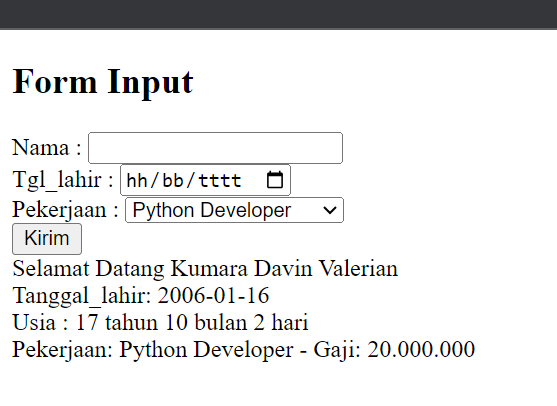

# Langkah-langkah Praktikum
### 1. install XAMPP

### 2. jalankan web server

### 3. uji server ok atau belum

### 4. PHP dasar

### 5. Variabel PHP

### 6. Predefine Variable $_GET

### 7. Membuat form input

### 8. operator

### 9. kondisi if

### 10. kondisi switch

### 11. perulangan for

### 12. perulangan while

### 13. perulangan dowhile

# Pertanyaan dan Tugas
Buatlah program PHP sederhana dengan menggunakan form input yang menampilkan nama, tanggal lahir dan pekerjaan. Kemudian tampilkan outputnya dengan menghitung umur berdasarkan inputan tanggal lahir. Dan pilihan pekerjaan dengan gaji yang berbeda-beda sesuai pilihan pekerjaan.

